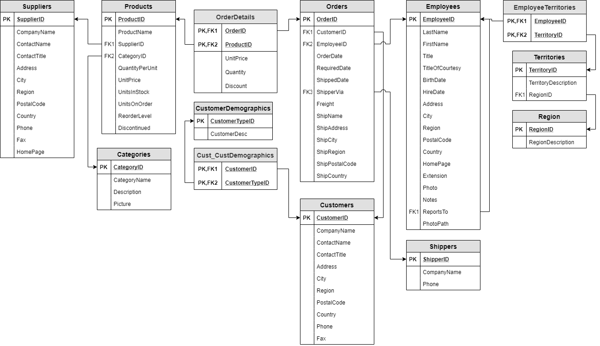

# Exercicis de GROUP BY i HAVING
**Base de dades: [northwind](../databases/northwind-db/DB_Northwind.sql "DB installation script")**

**Model Relacional:** 

1. Retorna un recompte de quants repartidors (shippers) hi ha.
2. Calcula quants proveïdors (suppliers) hi ha per ciutat.
3. Calcula quants productes diferents són distribuits pel shipper número 3.
4. Crea un informe amb el nom del distribuidor, nom del proveidor, nom de la categoria i el recompte de productes que coincideixen.
5. Mostra un informe amb el nom dels clients (customers.companyname) que han rebut més de tres paquets provinents del shipper número 3.
6. Mostra un recompte de les ordres que ha rebut cada customer ordenant pel recompte de forma descendent.
7. Mostra un recompte de clients (customers) per codi postal sempre i quant n'hi hagi més d'un al mateix codi postal.
8. Compta quants territoris diferents hi ha per cada regió. Mostra RegionDescription i el recompte.
9. Calcula la mitjana de comandes (orders) servides per cada shipper.
10. Compta quants empleats hi ha per cada territori. Mostra TerritoryDescription i el recompte.
11. Compta quants empleats hi ha per cada regió. Mostra RegionDescription i el recompte.
12. Retorna només el nom de la regió (region.description) que té més empleats.
13. Retorna el recompte de productes per categoria.
14. Calcula quants productes pot servir cada distribuïdor. Mostra el CompanyName i el recompte de productes.
15. Calcula quants empleats hi ha per Ciutat contractats a partir de l'any 1993.
